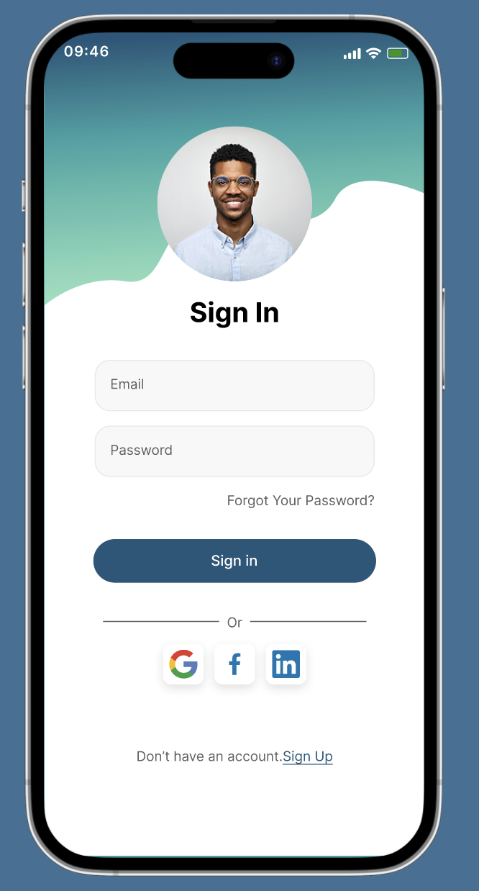

# TBC-Assignment-13
TBC IT Academy | iOS development Course | Module 2 | Assignment #13

## Assignment concept

This assignment aims to become more familiar with navigation patterns provided by Apple's UIKit framework for building iOS apps. Specifically, there are two different approaches / fundamental concepts for transitioning between view controllers: Push and Present. 
Part of the task is to create a main page from a sketch (Figma design file) fully programatically (without using storyboard). 

The assignment covers the following topics: 
* UINavigationController
* Navigate between view controllers: Push 
* Navigate between view controllers: Present 
* 

> The deadline of this task is: 28/10/2023, 10:00. 

